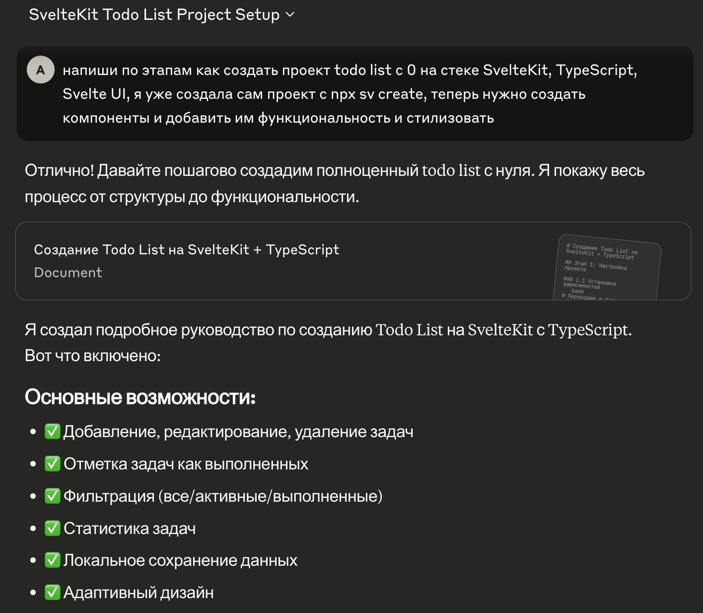
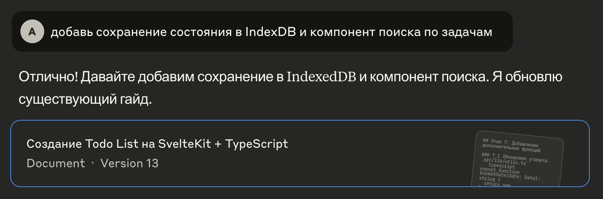

# 📝 ToDo App
https://svelte-todo-lyart.vercel.app/
Минималистичное и мощное ToDo-приложение с удобным управлением задачами, поиском и локальным хранением данных. Всё, что нужно для продуктивного дня — в одном месте.

## ✨ Основные возможности

- ✅ **Добавление задач** — быстро создавайте новые задачи.
- ✏️ **Редактирование** — изменяйте описание уже созданных задач.
- ❌ **Удаление** — удаляйте ненужные задачи по одной или все сразу.
- 📌 **Отметка выполнения** — отмечайте задачи как завершённые или возвращайте в активные.
- 📁 **Фильтры по статусу**:
  - Все задачи
  - Только активные
  - Только завершённые
- 🔍 **Поиск по задачам**:
  - Поддержка **регистрозависимого** поиска
  - Опция **точного совпадения**
- 🧹 **Очистка завершённых задач** — если есть выполненные задачи, появляется кнопка их удаления.
- ✔️ **Массовое завершение** — возможность одним действием отметить все задачи как завершённые.
- 📊 **Сводка внизу экрана**:
  - Общее количество задач
  - Количество завершённых
  - Количество активных
- 💾 **Локальное хранилище через IndexedDB**:
  - Все задачи сохраняются и восстанавливаются при перезагрузке страницы
- 📤 **Экспорт данных** — выгрузка задач в формате `.json`
- 🗑️ **Полная очистка** — удаление всех задач одним нажатием

## 🛠️ Технологии

- **SvelteKit**
- **TypeScript**
- **IndexedDB API**
- **Svelte UI**

## 📦 Экспорт и импорт

- Вы можете сохранить список задач в `.json` файл.
- Удобно для резервного копирования или переноса на другое устройство.

---
## 📚 Процесс разработки

Разработка ToDo-приложения заняла около **2 часов**. Вот поэтапный процесс:

### ⏱️ Тайминг и шаги

| Время       | Этап                                                                                      |
|-------------|--------------------------------------------------------------------------------------------|
| 23:00–23:05   | Инициализация проекта через `npx sv create todo-app` на основе SvelteKit + TypeScript    |
| 23:05–23:20   | Использование [Claude.ai](https://claude.ai) для генерации базовых компонентов и стилей. |
|             | 💬 **Промпт**: _"Напиши по этапам, как создать проект todo list с 0 на стеке SvelteKit, TypeScript, Svelte UI..."_ |
| 23:20–23:35   | Реализация основных функций: добавление, редактирование, удаление задач, отметка выполнения |
| 23:35–23:45   | Самостоятельное добавление фильтров по статусу задач: **все / активные / завершённые**    |
| 23:45–00:10   | Запрос к Claude: _"Добавь сохранение состояния в IndexedDB и компонент поиска по задачам"_ |
|             | → Добавлена интеграция с **IndexedDB** и расширенный **поиск** с опциями: регистр и точное совпадение |
| 00:10–01:00   | Проведён рефакторинг, улучшена структура кода, UI и логика управления задачами. Приложение готово к использованию ✅ |

---

# svelte-todo
